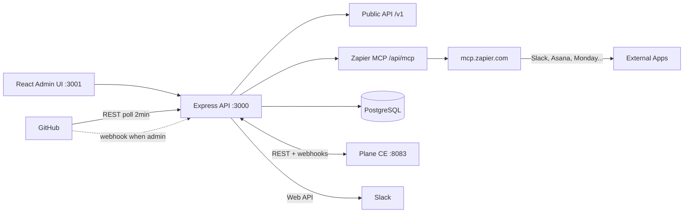

# Enterprise Claude Skills Platform

A multi-tenant **AI control plane** for governing Claude skills, agents, department suites, industry overlays, licensing, metering, approvals, audit, and integrations across enterprise workspaces.

> **Current branch:** `feature/jun25-agency-sprint` (Jun 25, 2026)
> Adds agency skills (12 total), public Agent API `/v1`, Zapier MCP (live + Slack tested), 3 workflow templates, Tasks UI badges.
> Built on `feature/github-poller` which added the EC2 GitHub Poller (interim inbound GitHub events).
> **Do not merge to `main` yet** — awaiting James approval.

---

## Project Overview

This is **not** a task manager or a prompt library. It is an enterprise **governance and operations console** that lets organizations:

- Register and govern **Claude Skills** as licensed product units  
- Bundle skills into **department suites** and **industry overlays**  
- Assign skills to **AI agents** with permissions and autonomy levels  
- Control access by **workspace**, **customer**, **entitlement**, and **risk tier**  
- **Meter usage** through skill credits and subscription tiers  
- Enforce **approvals**, **audit logging**, and **integration registry** workflows  
- Sync routed tasks to **Plane CE** work items and receive status updates via webhooks  
- Live **GitHub** PR/issue sync (EC2 poller + webhook handler) and **Slack** notifications — platform as integration hub  
- Expose a **public Agent API (`/v1`)** for marketplace and third-party integrations (Asana, Monday, Zapier, Make)  
- Connect agents to **9,000+ apps via Zapier MCP** without custom OAuth code  
- Run **multi-step agency workflows** (onboarding, B2B outbound, SEO pipeline) with a single API call  

---

## Integration hub status (Jun 25, 2026)

James approved: **Plane CE for PM + GitHub/Slack in our platform** (not Plane Commercial). Agency market confirmed as primary GTM focus.

**Overall: ~95% complete** for the approved integration scope. 12 skills live, public API live, Zapier MCP live.

### Done

- Plane CE pm-bridge — workspace/task sync, webhooks, 12/12 E2E tests
- GitHub outbound — live PAT connection test, issue/PR API
- GitHub inbound — EC2 poller live (every 2 min), PR/issue → task → Plane → Slack
- Slack outbound — route + status notifications to `#server-alerts`
- Slack inbound — Event Subscriptions enabled (`app_mention`); events logged
- Webhook receivers — `/webhooks/plane`, `/webhooks/github`, `/webhooks/slack`
- **12 skills** (6 core + 6 agency: SEO, ad copy, email sequence, landing page, social post, competitor report)
- **Public Agent API `/v1`** — skills, tasks, route, run, status (10/10 tests)
- **Zapier MCP** — live, Slack connected, message sent to #server-alerts (7/7 tests)
- **3 workflow templates** — agency onboarding, B2B outbound, SEO pipeline
- Admin UI — Dashboard, Integrations, Routing Demo, Tasks (Plane + GitHub + Slack badges), Agents
- E2E verified on EC2 — 43/43 tests pass across all suites

### Pending / upcoming

| Item | Owner | Notes |
|------|-------|-------|
| Native GitHub repo webhook | James / Shubham | 5 min when admin access available; specs sent |
| Merge `feature/jun25-agency-sprint` → `main` | James approval | Branch ready |
| Seed pricing packages into DB | Abhi | $99/$249/$599/Custom tiers, schema ready |
| Wire Stripe billing | James decision | DB tables ready |
| Add 14+ more skills (sales, CS, ops, HR, finance) | Abhi | 12 done, target 40+ |
| Add Asana + Monday to Zapier MCP server | Abhi | 5 min on mcp.zapier.com |
| Skill marketplace UI (ratings, usage stats) | Abhi | Phase 5 |
| Worker queues — fully autonomous execution | Abhi | Phase 2 — Redis already running |
| Affiliate program (PartnerStack / Rewardful) | James decision | 25–30% recurring commission |
| Landing page + pricing page | Abhi | For agency GTM Phase 1 |

Sprint logs: [memory/25th_June.md](memory/25th_June.md) · [memory/24th_June.md](memory/24th_June.md)

**Live demo (EC2):**

| Service | URL |
|---------|-----|
| Admin UI | http://54.167.31.169:3001 |
| API | http://54.167.31.169:3000 |
| Plane CE (PM) | http://54.167.31.169:8083 |
| Login (platform) | http://54.167.31.169:3001/login |
| Login (Plane) | http://54.167.31.169:8083 — `admin@planepmsystem.local` |

---

## Architecture



| Layer | Technology |
|-------|------------|
| Backend | Node.js, Express |
| Frontend | React 17 (admin UI) |
| Database | PostgreSQL 13 |
| PM layer | Plane CE (Django + React), self-hosted |
| Cache / Queue | Redis (workers planned) |
| Deploy | Docker Compose |

Detail: [docs/ARCHITECTURE.md](docs/ARCHITECTURE.md) · Plane: [docs/plane-integration.md](docs/plane-integration.md)

---

## Features

### Control plane (MVP)

| Module | Admin UI | API | Notes |
|--------|----------|-----|-------|
| Executive Dashboard | ✅ | ✅ | Live metrics from `/api/dashboard/summary` |
| Skill Registry & Packages | ✅ | ✅ | Search, pagination |
| Department Suites & Overlays | ✅ | ✅ | |
| Customers, Workspaces, Entitlements | ✅ | ✅ | |
| Credit Pools | ✅ | ✅ | |
| Agent Profiles | ✅ | ✅ | |
| Skill Runs | ✅ | ✅ | |
| Approvals | ✅ | ✅ | Approve / reject |
| Audit Logs | ✅ | ✅ | By run ID |
| Integrations | ✅ | ✅ | Live GitHub/Slack test; mock for others |
| Routing Demo | ✅ | ✅ | Task → route → apply |
| Reports | ✅ | ✅ | Multiple report endpoints |
| Auth | ✅ | ⚠️ | Bearer token + roles (not SSO) |

### PM Bridge (`feature/plane-pm-integration`)

| Capability | Status |
|--------------|--------|
| Workspace → Plane project sync | ✅ |
| Task → Plane work item sync (manual + auto on `route/apply`) | ✅ |
| Plane webhook → `task_intake.status` update | ✅ Registered |
| Graceful degradation if Plane not configured | ✅ 503, platform unaffected |
| E2E test suite | ✅ 12/12 (`scripts/test-pm-integration.sh`) |

### GitHub + Slack hub

| Capability | Status |
|--------------|--------|
| Live GitHub/Slack connection test | ✅ |
| Slack notify on route + status change | ✅ |
| Slack Event Subscriptions (`app_mention`) | ✅ |
| **EC2 GitHub Poller** (interim) | ✅ **LIVE** — polls every 2 min, task+Plane+Slack sync |
| GitHub webhook → task + Plane + Slack (native) | ⏳ admin access required to register webhook |
| Webhook receivers `/webhooks/github`, `/webhooks/slack` | ✅ |
| Integration test script | ✅ `scripts/test-integrations.sh` (6/6) |
| Poller E2E test script | ✅ `scripts/test-github-poller.sh` (8/8) |

### Agency features (`feature/jun25-agency-sprint`)

| Capability | Status |
|--------------|--------|
| 12 skills (6 core + 6 agency-focused) | ✅ |
| Public Agent API `/v1` (skills, tasks, route, run, status) | ✅ **LIVE** |
| Zapier MCP — 9,000+ app connections | ✅ **LIVE** (Slack connected, tested) |
| 3 workflow templates (agency onboarding, B2B outbound, SEO pipeline) | ✅ |
| Tasks UI — GitHub PR + Slack thread badges | ✅ |
| Agent API test script | ✅ `scripts/test-agent-api.sh` (10/10) |
| Zapier MCP test script | ✅ `scripts/test-zapier-mcp.sh` (7/7) |
| Pricing packages designed ($99/$249/$599/Custom) | ✅ Designed — DB schema ready, not seeded yet |

---

## Installation

### Prerequisites

- Node.js 18+ **or** Docker  
- PostgreSQL 13+ (provided by Docker Compose)  

### Docker setup (recommended)

```bash
git clone https://github.com/1Touch-dev/claude-skill-agent.git
cd claude-skill-agent
git checkout feature/github-poller
cp .env.example .env
# EC2: set PUBLIC_API_URL, PUBLIC_UI_URL, and PLANE_* vars (see plane-integration.md)
docker compose up -d --build
```

- **Platform local:** http://localhost:3001 (UI), http://localhost:3000 (API)  
- **Plane local:** http://localhost:8083  
- **EC2:** open security group ports **3000**, **3001**, and **8083** — do NOT open 5432 or 6379 (see [docs/ec2-security.md](docs/ec2-security.md))

### Plane CE (optional PM layer)

```bash
# Create shared network once
docker network create plane-net 2>/dev/null || true

# Start Plane stack
docker compose -f docker-compose-plane.yml up -d

# Bootstrap admin, workspace, API token → copy into .env
bash scripts/plane-setup.sh

# Restart backend to pick up PLANE_* vars
docker compose up -d --build backend

# Verify integration
bash scripts/test-pm-integration.sh http://localhost:3000
```

Full guide: [docs/plane-integration.md](docs/plane-integration.md)

### Keep running after you disconnect (EC2)

```bash
git pull origin feature/github-poller
docker compose up -d --build
docker compose -f docker-compose-plane.yml up -d
```

Verify: `curl http://54.167.31.169:3000/health/live`

### Native setup

See [docs/SETUP.md](docs/SETUP.md) for Postgres migrations and `npm run dev` / `npm start`.

---

## Demo Credentials

| Setting | Value |
|---------|--------|
| **Platform login** | http://54.167.31.169:3001/login |
| **Platform token** | `changeme` (from `ADMIN_TOKEN` in `.env`) |
| **Roles** | `admin`, `operator`, `viewer` |
| **Plane admin** | `admin@planepmsystem.local` / see `PLANE_ADMIN_PASSWORD` in `.env` |

**5-minute stakeholder script:** [docs/mvp-demo-script.md](docs/mvp-demo-script.md)  
**Business user guide:** [docs/user-guide.md](docs/user-guide.md)

---

## API Endpoints (summary)

Prefix: `/api` (authenticated via `Authorization: Bearer <token>` and optional `x-user-role` header).

| Area | Key endpoints |
|------|----------------|
| Dashboard | `GET /dashboard/summary` |
| Registry | `GET/POST/PUT/DELETE /skills`, `/packages` |
| Commercial | `GET/POST /customers`, `/workspaces`, `/entitlements`, `/credit-pools` |
| Agents & Runs | `GET/POST /agents`, `/runs`, `GET /runs/:id/audit` |
| Approvals | `GET /approvals`, `POST /approvals/:id/decide` |
| Integrations | `GET/POST/PUT/DELETE /integrations`, `POST /integrations/:id/test` |
| Routing | `GET/POST /tasks`, `POST /route`, `POST /route/apply` |
| **Workflows** | `GET /workflows`, `GET /workflows/:key`, `POST /workflows/:key/run` |
| **Zapier MCP** | `GET /mcp/status`, `GET /mcp/tools`, `POST /mcp/execute` |
| **PM Bridge** | `POST /pm/ping`, `POST /pm/workspaces/:id/sync`, `POST /pm/tasks/:id/sync` |
| Webhooks | `POST /webhooks/plane`, `/webhooks/github`, `/webhooks/slack` (no Bearer auth) |
| Health | `GET /health/live`, `GET /health/ready` |

**Public Agent API (no admin auth required, API key only):**

| Endpoint | Purpose |
|----------|---------|
| `GET /v1/health` | Liveness check |
| `GET /v1/skills` | List all enabled skills |
| `GET /v1/skills/:key` | Get single skill |
| `POST /v1/tasks` | Create task |
| `GET /v1/tasks/:id` | Get task with integration links |
| `GET /v1/tasks/:id/status` | Lightweight status poll |
| `POST /v1/tasks/:id/route` | Recommend agent (no persist) |
| `POST /v1/tasks/:id/run` | Route + create run + fire Plane/Slack |

Full reference: [docs/agent-api.md](docs/agent-api.md)

Full validation: [docs/api-validation-report.md](docs/api-validation-report.md) · PM detail: [docs/plane-integration.md](docs/plane-integration.md)

---

## Security

**EC2 firewall:** ports `3001` (UI), `3000` (API+webhooks), `8083` (Plane) are intentionally public for the demo.  
**PostgreSQL (5432) and Redis (6379) must NOT be open** to `0.0.0.0/0` — see the full audit in [docs/ec2-security.md](docs/ec2-security.md).

**Webhook hardening (P1-9):** `PLANE_WEBHOOK_ALLOWED_IPS` restricts which IPs may POST to `/webhooks/plane`. See [docs/runbook.md](docs/runbook.md) § Security.

```bash
# Re-run security audit at any time
bash scripts/audit-ec2-security.sh
```

---

## Documentation

### Start here

| Document | Purpose |
|----------|---------|
| [docs/user-guide.md](docs/user-guide.md) | Non-technical guide |
| [docs/mvp-demo-script.md](docs/mvp-demo-script.md) | 5-minute executive demo |
| [docs/agent-api.md](docs/agent-api.md) | **Public Agent API `/v1`** — marketplace integration reference |
| [docs/zapier-mcp.md](docs/zapier-mcp.md) | **Zapier MCP** — setup, API, supported apps |
| [docs/plane-integration.md](docs/plane-integration.md) | **Plane CE pm-bridge** — setup, API, webhooks |
| [docs/integration-github.md](docs/integration-github.md) | **GitHub** webhook + PR sync |
| [docs/github_webhooks.md](docs/github_webhooks.md) | **GitHub webhooks** — full state & return path from poller to native webhook |
| [docs/github_poller.md](docs/github_poller.md) | **GitHub Poller** — interim EC2 polling job (LIVE) |
| [docs/integration-slack.md](docs/integration-slack.md) | **Slack** notifications + Events API |
| [docs/mvp-known-limitations.md](docs/mvp-known-limitations.md) | Honest MVP boundaries |

### Sprint history

| Document | Purpose |
|----------|---------|
| [memory/25th_June.md](memory/25th_June.md) | **Jun 25** — Agency skills, Agent API, Zapier MCP live, workflows |
| [memory/24th_June.md](memory/24th_June.md) | **Jun 24** — James strategy: GTM, pricing, affiliate, skills roadmap |
| [memory/15th_June.md](memory/15th_June.md) | **Jun 15** — James approval, GitHub poller, E2E verification |
| [memory/12th_June.md](memory/12th_June.md) | **GitHub + Slack** platform hub sprint |
| [memory/10th_June.md](memory/10th_June.md) | **Plane PM integration** — spike, tests, webhook |
| [memory/3rd_June.md](memory/3rd_June.md) | MVP completion sprint |

### Technical reference

| Document | Purpose |
|----------|---------|
| [docs/SETUP.md](docs/SETUP.md) | Install and run |
| [docs/ARCHITECTURE.md](docs/ARCHITECTURE.md) | System design + PM layer |
| [docs/OPERATIONS.md](docs/OPERATIONS.md) | Operations notes |
| [docs/ec2-security.md](docs/ec2-security.md) | EC2 security group audit + hardening guide |
| [docs/runbook.md](docs/runbook.md) | Start/stop/logs/troubleshooting/security |

---

## Project Structure

```
claude-skill-agent/
├── backend/
│   ├── src/services/pm-bridge/        # Plane REST client
│   ├── src/services/github/           # GitHub API client
│   ├── src/services/slack/            # Slack Web API client
│   ├── src/services/zapier-mcp/       # Zapier MCP client (NEW)
│   ├── src/routes/pm.js               # /api/pm/*
│   ├── src/routes/agent-api.js        # /v1/* public API (NEW)
│   ├── src/routes/mcp.js              # /api/mcp/* (NEW)
│   ├── src/routes/workflows.js        # /api/workflows/* (NEW)
│   ├── src/jobs/github-poller.js      # EC2 GitHub poller (interim inbound)
│   ├── src/routes/webhooks.js         # /webhooks/plane|github|slack
│   └── db/migrations/
│       ├── 0011_github_slack_links.sql
│       ├── 0012_github_poller.sql
│       └── 0013_agency_skills.sql     # 6 agency skills (NEW)
├── backend/data/workflows/            # Workflow template JSON files (NEW)
├── frontend/                          # React admin UI
├── docs/
│   ├── agent-api.md                   # Public /v1 API reference (NEW)
│   ├── zapier-mcp.md                  # Zapier MCP setup + API (NEW)
│   ├── github_poller.md
│   └── github_webhooks.md
├── memory/                            # Sprint logs
│   ├── 25th_June.md                   # Latest sprint log (NEW)
│   └── 24th_June.md                   # James strategy session
├── scripts/
│   ├── test-agent-api.sh              # 10-test /v1 API suite (NEW)
│   ├── test-zapier-mcp.sh             # 7-test Zapier MCP suite (NEW)
│   ├── test-pm-integration.sh         # 12-test PM e2e suite
│   ├── test-integrations.sh           # GitHub + Slack connector tests
│   └── test-github-poller.sh          # 8-test poller e2e suite
├── docker-compose.yml                 # Platform stack
└── docker-compose-plane.yml           # Plane CE stack
```

---

## Testing

```bash
cd backend && npm test
./scripts/api-validate.sh
bash scripts/test-pm-integration.sh http://localhost:3000    # Plane — 12/12
bash scripts/test-integrations.sh http://localhost:3000     # GitHub + Slack — 6/6
bash scripts/test-github-poller.sh http://localhost:3000    # GitHub poller — 8/8
bash scripts/test-agent-api.sh                              # Public Agent API — 10/10
bash scripts/test-zapier-mcp.sh                             # Zapier MCP — 7/7
# Total: 43 tests, 0 failures
```

---

## Branch policy

| Branch | Purpose |
|--------|---------|
| `main` | Stable MVP baseline — **no integration merge until James approves** |
| `feature/plane-pm-integration` | Plane CE pm-bridge (base) |
| `feature/platform-github-slack` | GitHub + Slack hub, Plane bridge |
| `feature/github-poller` | EC2 GitHub poller (interim inbound GitHub) |
| `feature/jun25-agency-sprint` | **Active** — agency skills, Agent API, Zapier MCP, workflows |

---

## Quick Health Check

```bash
curl http://54.167.31.169:3000/health/live
# → {"status":"ok","live":true}

curl -X POST http://54.167.31.169:3000/api/pm/ping -H "Authorization: Bearer changeme"
# → {"ok":true,"plane_enabled":true,...}  (when Plane configured)
```

---

## License

MIT
