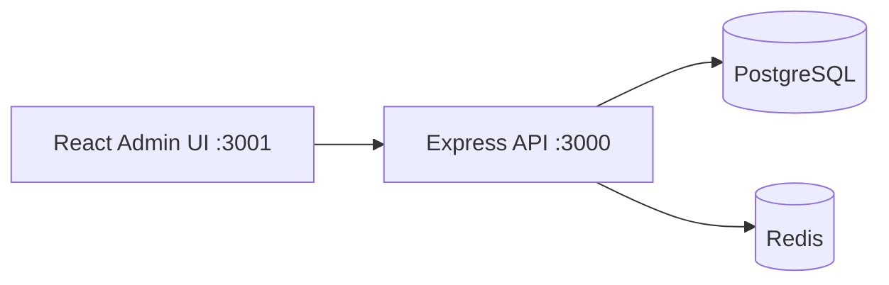

# Enterprise Claude Skills Platform

A multi-tenant **AI control plane** for governing Claude skills, agents, department suites, industry overlays, licensing, metering, approvals, audit, and integrations across enterprise workspaces.

> **MVP status (June 2026):** Stakeholder-demo ready on branch `feature/mvp-completion-june-3`.  
> See [docs/mvp-known-limitations.md](docs/mvp-known-limitations.md) for honest boundaries.

---

## Project Overview

This is **not** a task manager or a prompt library. It is an enterprise **governance and operations console** that lets organizations:

- Register and govern **Claude Skills** as licensed product units  
- Bundle skills into **department suites** and **industry overlays**  
- Assign skills to **AI agents** with permissions and autonomy levels  
- Control access by **workspace**, **customer**, **entitlement**, and **risk tier**  
- **Meter usage** through skill credits and subscription tiers  
- Enforce **approvals**, **audit logging**, and **integration registry** workflows  

**Live demo (EC2):**

| Service | URL |
|---------|-----|
| Admin UI | http://54.167.31.169:3001 |
| API | http://54.167.31.169:3000 |
| Login | http://54.167.31.169:3001/login |

---

## Architecture



| Layer | Technology |
|-------|------------|
| Backend | Node.js, Express |
| Frontend | React 17 (admin UI) |
| Database | PostgreSQL 13 |
| Cache / Queue | Redis (workers planned) |
| Deploy | Docker Compose |

Detail: [docs/ARCHITECTURE.md](docs/ARCHITECTURE.md)

---

## Features (MVP)

| Module | Admin UI | API | MVP notes |
|--------|----------|-----|-----------|
| Executive Dashboard | ✅ | ✅ | Live metrics from `/api/dashboard/summary` |
| Skill Registry & Packages | ✅ | ✅ | Search, pagination |
| Department Suites & Overlays | ✅ | ✅ | |
| Customers, Workspaces, Entitlements | ✅ | ✅ | |
| Credit Pools | ✅ | ✅ | |
| Agent Profiles | ✅ | ✅ | |
| Skill Runs | ✅ | ✅ | |
| Approvals | ✅ | ✅ | Approve / reject |
| Audit Logs | ✅ | ✅ | By run ID |
| Integrations | ✅ | ✅ | Mock test connection |
| Routing Demo | ✅ | ✅ | Task → route → apply |
| Reports | ✅ | ✅ | Multiple report endpoints |
| Auth | ✅ | ⚠️ | Bearer token + roles (not SSO) |

---

## MVP Scope

**In scope:** Control-plane CRUD, live dashboard, MVP auth, approvals, integration registry + mock test, routing demo, reports, Docker on EC2, QA acceptance.

**Out of scope:** SSO, production OAuth, webhooks, workers, RAG, full PM app, enterprise observability.

Full list: [docs/mvp-known-limitations.md](docs/mvp-known-limitations.md)

---

## Installation

### Prerequisites

- Node.js 18+ **or** Docker  
- PostgreSQL 13+ (provided by Docker Compose)  

### Docker setup (recommended for demo)

```bash
git clone https://github.com/1Touch-dev/claude-skill-agent.git
cd claude-skill-agent
git checkout feature/mvp-completion-june-3
cp .env.example .env
# EC2: set PUBLIC_API_URL=http://<your-ip>:3000 and PUBLIC_UI_URL=http://<your-ip>:3001
docker compose up -d --build
```

- **Local:** http://localhost:3001 (UI), http://localhost:3000 (API)  
- **EC2:** http://54.167.31.169:3001 — open security group ports **3000** and **3001**

### Native setup

See [docs/SETUP.md](docs/SETUP.md) for Postgres migrations and `npm run dev` / `npm start`.

```bash
cp .env.example .env
cp frontend/.env.example frontend/.env
cd backend && npm install && npm run migrate
cd backend && npm run dev    # port 3000
cd frontend && npm install && npm start   # port 3001
```

---

## Demo Credentials

| Setting | Value |
|---------|--------|
| **Login URL** | http://54.167.31.169:3001/login |
| **Token** | `changeme` (from `ADMIN_TOKEN` in `.env`) |
| **Roles** | `admin`, `operator`, `viewer` |

**5-minute stakeholder script:** [docs/mvp-demo-script.md](docs/mvp-demo-script.md)  
**Business user guide:** [docs/user-guide.md](docs/user-guide.md)

---

## API Endpoints (summary)

Prefix: `/api` (authenticated via `Authorization: Bearer <token>` and optional `x-user-role` header).

| Area | Key endpoints |
|------|----------------|
| Dashboard | `GET /dashboard/summary` |
| Registry | `GET/POST/PUT/DELETE /skills`, `/packages` |
| Suites | `GET/POST /suites`, `/overlays` |
| Commercial | `GET/POST /customers`, `/workspaces`, `/entitlements`, `/credit-pools` |
| Agents | `GET/POST /agents` |
| Runs | `GET/POST /runs`, `GET /runs/:id/audit` |
| Approvals | `GET /approvals`, `POST /approvals/:id/decide` |
| Integrations | `GET/POST/PUT/DELETE /integrations`, `POST /integrations/:id/test` |
| Routing | `GET/POST /tasks`, `POST /route`, `POST /route/apply` |
| Reports | `GET /reports/*` |
| Health | `GET /health/live`, `GET /health/ready` |

Full validation: [docs/api-validation-report.md](docs/api-validation-report.md)

---

## Documentation

### Start here (stakeholder / new team member)

| Document | Purpose |
|----------|---------|
| **[docs/user-guide.md](docs/user-guide.md)** | Non-technical guide + 5-minute example walkthrough |
| **[docs/mvp-demo-script.md](docs/mvp-demo-script.md)** | 5-minute executive demo script |
| **[docs/mvp-known-limitations.md](docs/mvp-known-limitations.md)** | Honest MVP boundaries |

### QA and acceptance

| Document | Purpose |
|----------|---------|
| [docs/mvp-acceptance-report.md](docs/mvp-acceptance-report.md) | MVP acceptance verdict |
| [docs/api-validation-report.md](docs/api-validation-report.md) | API endpoint matrix |
| [docs/live-browser-test-report.md](docs/live-browser-test-report.md) | Live Cursor browser proof |

### Sprint history

| Document | Purpose |
|----------|---------|
| [memory/3rd_June.md](memory/3rd_June.md) | MVP completion sprint log |
| [memory/2nd_June.md](memory/2nd_June.md) | Full requirements / completion plan |

### Technical reference

| Document | Purpose |
|----------|---------|
| [docs/SETUP.md](docs/SETUP.md) | Install and run |
| [docs/ARCHITECTURE.md](docs/ARCHITECTURE.md) | System design |
| [docs/HANDBOOK_GAP_ANALYSIS.md](docs/HANDBOOK_GAP_ANALYSIS.md) | Requirements vs build |
| [docs/OPERATIONS.md](docs/OPERATIONS.md) | Operations notes |

---

## Project Structure

```
claude-skill-agent/
├── backend/           # Express API, migrations, tests
├── frontend/          # React admin UI
├── docs/              # User guide, demo script, QA reports
├── memory/            # Sprint logs and progress
├── scripts/           # api-validate.sh
├── docker-compose.yml
└── .env.example
```

---

## Testing

```bash
cd backend && npm test
./scripts/api-validate.sh
```

---

## Quick Health Check

```bash
curl http://54.167.31.169:3000/health/live
# → {"status":"ok","live":true}
```

---

## License

MIT
