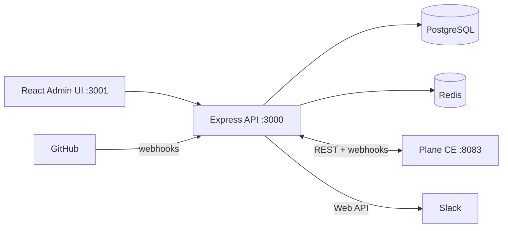

# Enterprise Claude Skills Platform

A multi-tenant **AI control plane** for governing Claude skills, agents, department suites, industry overlays, licensing, metering, approvals, audit, and integrations across enterprise workspaces.

> **Current branch:** `feature/platform-github-slack` (June 2026)  
> Adds **Plane CE** pm-bridge + **live GitHub/Slack** integrations (platform hub, not Plane Commercial).  
> **Do not merge to `main` yet** — awaiting James approval.

---

## Project Overview

This is **not** a task manager or a prompt library. It is an enterprise **governance and operations console** that lets organizations:

- Register and govern **Claude Skills** as licensed product units  
- Bundle skills into **department suites** and **industry overlays**  
- Assign skills to **AI agents** with permissions and autonomy levels  
- Control access by **workspace**, **customer**, **entitlement**, and **risk tier**  
- **Meter usage** through skill credits and subscription tiers  
- Enforce **approvals**, **audit logging**, and **integration registry** workflows  
- **(Plane branch)** Sync routed tasks to **Plane CE** work items and receive status updates via webhooks  
- **(Integrations branch)** Live **GitHub** PR/issue webhooks and **Slack** notifications — platform as integration hub  

**Live demo (EC2):**

| Service | URL |
|---------|-----|
| Admin UI | http://54.167.31.169:3001 |
| API | http://54.167.31.169:3000 |
| Plane CE (PM) | http://54.167.31.169:8083 |
| Login (platform) | http://54.167.31.169:3001/login |
| Login (Plane) | http://54.167.31.169:8083 — `admin@planepmsystem.local` |

---

## Architecture



| Layer | Technology |
|-------|------------|
| Backend | Node.js, Express |
| Frontend | React 17 (admin UI) |
| Database | PostgreSQL 13 |
| PM layer | Plane CE (Django + React), self-hosted |
| Cache / Queue | Redis (workers planned) |
| Deploy | Docker Compose |

Detail: [docs/ARCHITECTURE.md](docs/ARCHITECTURE.md) · Plane: [docs/plane-integration.md](docs/plane-integration.md)

---

## Features

### Control plane (MVP)

| Module | Admin UI | API | Notes |
|--------|----------|-----|-------|
| Executive Dashboard | ✅ | ✅ | Live metrics from `/api/dashboard/summary` |
| Skill Registry & Packages | ✅ | ✅ | Search, pagination |
| Department Suites & Overlays | ✅ | ✅ | |
| Customers, Workspaces, Entitlements | ✅ | ✅ | |
| Credit Pools | ✅ | ✅ | |
| Agent Profiles | ✅ | ✅ | |
| Skill Runs | ✅ | ✅ | |
| Approvals | ✅ | ✅ | Approve / reject |
| Audit Logs | ✅ | ✅ | By run ID |
| Integrations | ✅ | ✅ | Live GitHub/Slack test; mock for others |
| Routing Demo | ✅ | ✅ | Task → route → apply |
| Reports | ✅ | ✅ | Multiple report endpoints |
| Auth | ✅ | ⚠️ | Bearer token + roles (not SSO) |

### PM Bridge (`feature/plane-pm-integration`)

| Capability | Status |
|--------------|--------|
| Workspace → Plane project sync | ✅ |
| Task → Plane work item sync (manual + auto on `route/apply`) | ✅ |
| Plane webhook → `task_intake.status` update | ✅ Registered |
| Graceful degradation if Plane not configured | ✅ 503, platform unaffected |
| E2E test suite | ✅ 12/12 (`scripts/test-pm-integration.sh`) |

### GitHub + Slack hub (`feature/platform-github-slack`)

| Capability | Status |
|--------------|--------|
| Live GitHub/Slack connection test | ✅ |
| Slack notify on route + status change | ✅ |
| Slack Event Subscriptions (`app_mention`) | ✅ |
| GitHub webhook → task + Plane + Slack | ✅ (repo webhook needs admin) |
| Webhook receivers `/webhooks/github`, `/webhooks/slack` | ✅ |
| Integration test script | ✅ `scripts/test-integrations.sh` |

Guides: [docs/integration-github.md](docs/integration-github.md) · [docs/integration-slack.md](docs/integration-slack.md)

MVP boundaries: [docs/mvp-known-limitations.md](docs/mvp-known-limitations.md)

---

## Installation

### Prerequisites

- Node.js 18+ **or** Docker  
- PostgreSQL 13+ (provided by Docker Compose)  

### Docker setup (recommended)

```bash
git clone https://github.com/1Touch-dev/claude-skill-agent.git
cd claude-skill-agent
git checkout feature/plane-pm-integration
cp .env.example .env
# EC2: set PUBLIC_API_URL, PUBLIC_UI_URL, and PLANE_* vars (see plane-integration.md)
docker compose up -d --build
```

- **Platform local:** http://localhost:3001 (UI), http://localhost:3000 (API)  
- **Plane local:** http://localhost:8083  
- **EC2:** open security group ports **3000**, **3001**, and **8083** — do NOT open 5432 or 6379 (see [docs/ec2-security.md](docs/ec2-security.md))

### Plane CE (optional PM layer)

```bash
# Create shared network once
docker network create plane-net 2>/dev/null || true

# Start Plane stack
docker compose -f docker-compose-plane.yml up -d

# Bootstrap admin, workspace, API token → copy into .env
bash scripts/plane-setup.sh

# Restart backend to pick up PLANE_* vars
docker compose up -d --build backend

# Verify integration
bash scripts/test-pm-integration.sh http://localhost:3000
```

Full guide: [docs/plane-integration.md](docs/plane-integration.md)

### Keep running after you disconnect (EC2)

```bash
git pull origin feature/plane-pm-integration
docker compose up -d --build
docker compose -f docker-compose-plane.yml up -d
```

Verify: `curl http://54.167.31.169:3000/health/live`

### Native setup

See [docs/SETUP.md](docs/SETUP.md) for Postgres migrations and `npm run dev` / `npm start`.

---

## Demo Credentials

| Setting | Value |
|---------|--------|
| **Platform login** | http://54.167.31.169:3001/login |
| **Platform token** | `changeme` (from `ADMIN_TOKEN` in `.env`) |
| **Roles** | `admin`, `operator`, `viewer` |
| **Plane admin** | `admin@planepmsystem.local` / see `PLANE_ADMIN_PASSWORD` in `.env` |

**5-minute stakeholder script:** [docs/mvp-demo-script.md](docs/mvp-demo-script.md)  
**Business user guide:** [docs/user-guide.md](docs/user-guide.md)

---

## API Endpoints (summary)

Prefix: `/api` (authenticated via `Authorization: Bearer <token>` and optional `x-user-role` header).

| Area | Key endpoints |
|------|----------------|
| Dashboard | `GET /dashboard/summary` |
| Registry | `GET/POST/PUT/DELETE /skills`, `/packages` |
| Commercial | `GET/POST /customers`, `/workspaces`, `/entitlements`, `/credit-pools` |
| Agents & Runs | `GET/POST /agents`, `/runs`, `GET /runs/:id/audit` |
| Approvals | `GET /approvals`, `POST /approvals/:id/decide` |
| Integrations | `GET/POST/PUT/DELETE /integrations`, `POST /integrations/:id/test` |
| Routing | `GET/POST /tasks`, `POST /route`, `POST /route/apply` |
| **PM Bridge** | `POST /pm/ping`, `POST /pm/workspaces/:id/sync`, `POST /pm/tasks/:id/sync` |
| Webhooks | `POST /webhooks/plane`, `/webhooks/github`, `/webhooks/slack` (no Bearer auth) |
| Health | `GET /health/live`, `GET /health/ready` |

Full validation: [docs/api-validation-report.md](docs/api-validation-report.md) · PM detail: [docs/plane-integration.md](docs/plane-integration.md)

---

## Security

**EC2 firewall:** ports `3001` (UI), `3000` (API+webhooks), `8083` (Plane) are intentionally public for the demo.  
**PostgreSQL (5432) and Redis (6379) must NOT be open** to `0.0.0.0/0` — see the full audit in [docs/ec2-security.md](docs/ec2-security.md).

**Webhook hardening (P1-9):** `PLANE_WEBHOOK_ALLOWED_IPS` restricts which IPs may POST to `/webhooks/plane`. See [docs/runbook.md](docs/runbook.md) § Security.

```bash
# Re-run security audit at any time
bash scripts/audit-ec2-security.sh
```

---

## Documentation

### Start here

| Document | Purpose |
|----------|---------|
| [docs/user-guide.md](docs/user-guide.md) | Non-technical guide |
| [docs/mvp-demo-script.md](docs/mvp-demo-script.md) | 5-minute executive demo |
| [docs/plane-integration.md](docs/plane-integration.md) | **Plane CE pm-bridge** — setup, API, webhooks |
| [docs/integration-github.md](docs/integration-github.md) | **GitHub** webhook + PR sync |
| [docs/integration-slack.md](docs/integration-slack.md) | **Slack** notifications + Events API |
| [docs/pm-platform-feasibility-study.md](docs/pm-platform-feasibility-study.md) | Worksuite vs Taskly vs Plane decision |
| [docs/mvp-known-limitations.md](docs/mvp-known-limitations.md) | Honest MVP boundaries |

### Sprint history

| Document | Purpose |
|----------|---------|
| [memory/12th_June.md](memory/12th_June.md) | **GitHub + Slack** platform hub sprint |
| [memory/10th_June.md](memory/10th_June.md) | **Plane PM integration** — spike, tests, webhook |
| [memory/3rd_June.md](memory/3rd_June.md) | MVP completion sprint |
| [memory/2nd_June.md](memory/2nd_June.md) | Full requirements / completion plan |

### Technical reference

| Document | Purpose |
|----------|---------|
| [docs/SETUP.md](docs/SETUP.md) | Install and run |
| [docs/ARCHITECTURE.md](docs/ARCHITECTURE.md) | System design + PM layer |
| [docs/OPERATIONS.md](docs/OPERATIONS.md) | Operations notes |
| [docs/ec2-security.md](docs/ec2-security.md) | EC2 security group audit + hardening guide |
| [docs/runbook.md](docs/runbook.md) | Start/stop/logs/troubleshooting/security |

---

## Project Structure

```
claude-skill-agent/
├── backend/
│   ├── src/services/pm-bridge/   # Plane REST client
│   ├── src/services/github/      # GitHub API client
│   ├── src/services/slack/       # Slack Web API client
│   ├── src/routes/pm.js          # /api/pm/*
│   ├── src/routes/webhooks.js    # /webhooks/plane|github|slack
│   └── db/migrations/0009_pm_bridge.sql, 0011_github_slack_links.sql
├── frontend/                     # React admin UI
├── docs/                         # Guides, feasibility study, plane-integration
├── memory/                       # Sprint logs (10th_June.md = Plane spike)
├── scripts/
│   ├── plane-setup.sh            # Bootstrap Plane CE
│   ├── test-pm-integration.sh    # 12-test PM e2e suite
│   └── test-integrations.sh      # GitHub + Slack connector tests
├── docker-compose.yml            # Platform stack (+ plane-net)
└── docker-compose-plane.yml      # Plane CE stack
```

---

## Testing

```bash
cd backend && npm test
./scripts/api-validate.sh
bash scripts/test-pm-integration.sh http://localhost:3000   # requires Plane + backend
bash scripts/test-integrations.sh http://localhost:3000    # GitHub + Slack connectors
```

---

## Branch policy

| Branch | Purpose |
|--------|---------|
| `main` | Stable MVP baseline — **no Plane merge until approved** |
| `feature/plane-pm-integration` | Plane CE pm-bridge (merged into integrations branch) |
| `feature/platform-github-slack` | **Active** — GitHub + Slack hub, Plane bridge |

---

## Quick Health Check

```bash
curl http://54.167.31.169:3000/health/live
# → {"status":"ok","live":true}

curl -X POST http://54.167.31.169:3000/api/pm/ping -H "Authorization: Bearer changeme"
# → {"ok":true,"plane_enabled":true,...}  (when Plane configured)
```

---

## License

MIT
