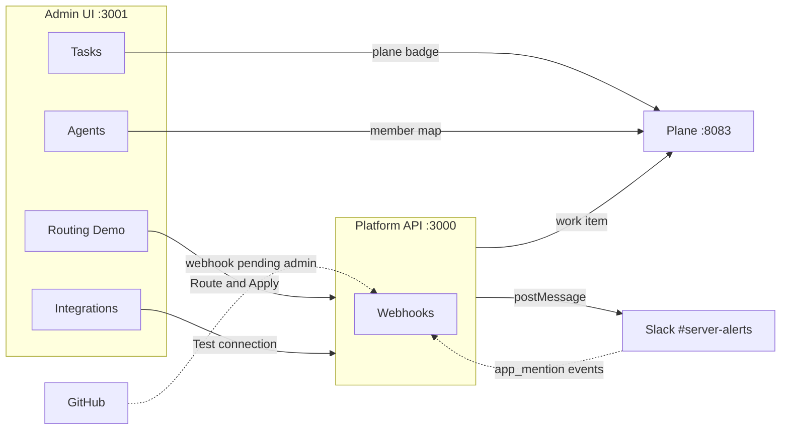
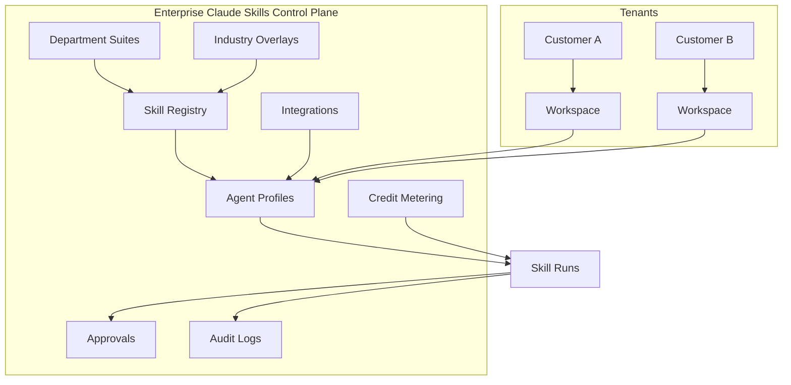
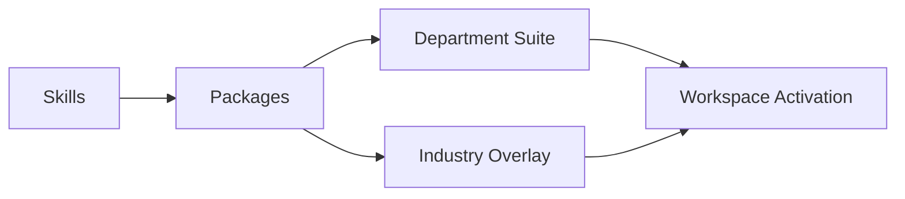

# Enterprise Claude Skills Platform — User Guide

**Audience:** Business users, managers, and stakeholders (non-technical)  
**MVP demo environment:** http://54.167.31.169:3001  
**Last updated:** June 12, 2026 (evening — live browser verification)

---

## Integration hub — what’s wired and where to see it

The platform is the **hub** between GitHub, Slack, and Plane CE. Most of today’s work runs **automatically in the backend** when you use **Routing Demo**; only **Plane** has rich visibility inside this admin UI today.

### At a glance

| System | Wired & working? | Where you see it in **Enterprise Claude Skills** (`:3001`) | Where you see it outside the UI |
|--------|------------------|----------------------------------------------------------|-----------------------------------|
| **Plane CE** | ✅ Yes | **Tasks** (✈ badge), **Routing Demo**, **Agents** (Plane member dropdown), **Open Plane ↗** link | Plane board at http://54.167.31.169:8083 |
| **Slack** (outbound) | ✅ Yes | **Integrations** → Slack → **Test** (`connected`, live API) | Message in Kyma **#server-alerts** after Route & Apply |
| **Slack** (inbound events) | ⏳ Logged only | Not shown in UI yet | Slack app Event Subscriptions configured (`app_mention`) |
| **GitHub** (API) | ✅ Yes | **Integrations** → GitHub → **Test** (`connected`, live API) | — |
| **GitHub** (PR webhooks) | ⏳ Backend ready | **Not shown in UI** (no PR badge on Tasks yet) | Needs repo webhook by admin on GitHub |
| **Asana / Monday / Trello** | Mock only | **Integrations** → Test returns mock OK | — |

### Menu-by-menu guide

| Menu | Plane | Slack | GitHub |
|------|-------|-------|--------|
| **Dashboard** | Indirect (task/run counts) | Indirect (integrations count) | Indirect |
| **Integrations** | — | ✅ Live **Test** → `slack: connected — live Slack API OK` | ✅ Live **Test** → `github: connected — live GitHub API OK` |
| **Routing Demo** | ✅ ✈ badge after Route & Apply | ✅ Triggers Slack post (check `#server-alerts`) | — |
| **Tasks** | ✅ **19/19 synced**, ✈ # links to Plane issue | Not shown (no Slack column yet) | Not shown (no PR column yet) |
| **Agents** | ✅ **Plane Member** dropdown maps agent → Plane assignee | — | — |
| **Runs** | Run records from routing | — | — |

### What is **not** in the UI yet (honest MVP)

- No **GitHub PR** or **Slack thread** links on the Tasks table (data is stored in the database; UI badges are deferred).
- No **inbound Slack command** handling — events are received and logged, not acted on.
- **GitHub repo webhook** must be added by a repo admin on GitHub.com (not in this UI).

### Live verification (June 12, 2026)

Tested in the browser at http://54.167.31.169:3001 and via `scripts/test-integrations.sh`:

| Test | Result |
|------|--------|
| Integrations → GitHub **Test** | ✅ `Authenticated as Abhishek9302 — live GitHub API OK` |
| Integrations → Slack **Test** | ✅ `Authenticated as globex_platform — live Slack API OK` |
| Routing Demo → create + **Route & Apply** task #19 | ✅ Routed to Globex Agent; Plane ✈ **#23**; Slack message sent to `#server-alerts` |
| Tasks page | ✅ **19/19** synced to Plane |
| Agents → Plane Member mapping | ✅ Dropdown populated (Admin) |
| API script `test-integrations.sh` | ✅ **6/6 PASS** |

**To confirm Slack:** open the Kyma Slack workspace → channel **#server-alerts** → look for the “task routed” message for *Jun12 live integration test task*.

**To confirm Plane:** on **Tasks**, click **✈ #23 Open in Plane →** or use **Open Plane ↗** (top right).

---

## What Is This System?

The **Enterprise Claude Skills Platform** is a **multi-tenant AI control plane**. Think of it as the “operating system” your company uses to govern how AI skills and agents are licensed, deployed, monitored, and audited across teams and customers.

It is **not** a general project-management tool or a chat window. It is the **governance and operations console** for enterprise AI capability.

### Core capabilities

| Capability | What it means for the business |
|------------|--------------------------------|
| **Multi-tenant AI control plane** | One platform serves many customers and workspaces with isolated configuration. |
| **Skills governance** | Every AI skill is registered, versioned, and controlled (lifecycle, risk, review). |
| **Agent management** | AI agents are defined with allowed skills, autonomy level, and workspace scope. |
| **Department suites** | Skills are packaged for departments (Marketing, Engineering, GRC, etc.). |
| **Industry overlays** | Add-on capability packs for industries (SaaS, FinServ, Healthcare, etc.). |
| **Approvals** | High-risk runs can require human approve/reject before proceeding. |
| **Audit logging** | Every important action on a run is recorded for compliance and troubleshooting. |
| **Integrations** | Registry for GitHub, Slack, Asana, etc. GitHub and Slack use **live** connections; others are mock in MVP. |
| **Usage metering** | Skill runs consume credits; pools and reports support chargeback and planning. |

---

## Logging In

**URL:** http://54.167.31.169:3001/login

**Demo token:** `changeme`

### Roles

| Role | Who typically uses it | What they can do in the MVP |
|------|----------------------|-----------------------------|
| **Admin** | Platform owner, IT lead | Full access: view all modules, approve/reject, create integrations, routing demo. |
| **Operator** | Team lead, ops | Manage runs, approvals, integrations; same write access as admin in MVP. |
| **Viewer** | Executive, auditor | Read-only visibility across dashboards and lists. |

**How to sign in**

1. Open the login URL in your browser.
2. Enter the admin token (`changeme` for demo).
3. Select your role (Admin for demos).
4. Click **Continue to control plane**.
5. You land on the **Executive Dashboard**.

To sign out, use **Log out** in the top header.

---

## Dashboard

**Menu:** Dashboard  
**Purpose:** Live snapshot of platform health and scale.

| Metric | Meaning |
|--------|---------|
| **Total / Active Skills** | How many skills exist and how many are enabled for use. |
| **Agents** | Configured AI agent profiles that can execute skills. |
| **Runs** | Completed or in-progress skill executions. |
| **Pending Approvals** | Runs waiting for a human decision. |
| **Integrations** | Registered external connectors; “connected” shows healthy/mock-connected count. |
| **Customers / Workspaces** | Commercial tenants and their isolated environments. |

Metrics are loaded from the live API — they are **not** hardcoded numbers.

---

## Skills

**Menu:** Skills

The **skill registry** is the catalog of governed AI capabilities (e.g. “Campaign Brief Generator”).

| Concept | Explanation |
|---------|-------------|
| **Skill key** | Unique identifier used when routing work to an agent. |
| **Lifecycle** | State such as enabled, disabled, or quarantined. |
| **Risk tier** | How sensitive the skill is (higher tier → more likely to need approval). |
| **Trust / review** | Governance labels from security review (MVP shows seeded demo values). |

**Search:** Use the search box to filter by skill name (e.g. type “Campaign” to find marketing skills).

---

## Packages

**Menu:** Packages

**Skill packages** tie a skill to a version, registry source, and integrity metadata. This supports provenance and change control in enterprise deployments.

---

## Suites & Overlays

### Department Suites

**Menu:** Suites

Bundles of skills aimed at a **department** (Marketing, Engineering, Customer Success, etc.). Used for licensing and activation by team.

### Industry Overlays

**Menu:** Overlays

Add-on packs for **industries** (e.g. FinServ, Healthcare). Customers can license overlays on top of base suites.

---

## Customers, Workspaces, Entitlements, Credit Pools

| Menu | Purpose |
|------|---------|
| **Customers** | Top-level commercial accounts (e.g. Acme Corp, Globex Inc). |
| **Workspaces** | Isolated environments under a customer. |
| **Entitlements** | What each workspace is licensed to use. |
| **Credit Pools** | Metering buckets for skill credit consumption. |

These screens support **multi-tenant operations** and future billing models.

---

## Tasks

**Menu:** Tasks

Lists every **task intake** with **PM sync status** to Plane CE.

| Element | Meaning |
|---------|---------|
| **✈ #N** badge | Task synced to Plane work item sequence #N — click to open in Plane |
| **Open Plane ↗** | Opens the Plane project board in a new tab |
| **Synced (N)** filter | How many tasks have a Plane work item |
| **Refresh** | Reload task list from API |

This is the **primary place to see Plane integration** in the admin UI. GitHub and Slack side effects are not shown as columns here yet (June 2026 MVP).

---

## Agents

**Menu:** Agents

An **agent** is a configured executor: which workspace it belongs to, which skills it may run, and its **autonomy level** (how much it can do without human oversight).

| Column | Purpose |
|--------|---------|
| **Plane Member** | Maps each agent to a Plane workspace member so routed work items are **auto-assigned** in Plane |

Agents do not “think” inside this UI — the platform **governs and routes** work to them. Execution is represented by **runs** and **routing demo** flows.

---

## Runs

**Menu:** Runs

A **run** is one execution of a skill (queued, awaiting approval, succeeded, failed, etc.). Use this list to see operational history and status.

---

## Approvals

**Menu:** Approvals

When a skill or run is **high risk**, an **approval gate** may require a human decision.

| Action | Effect |
|--------|--------|
| **Approve** | Run moves forward (approved state); decision is audited. |
| **Reject** | Run is rejected / failed; reason is stored. |

In demo, if no pending items appear, an operator can seed a pending approval (technical step) — during live demos you should see pending rows when prepared.

---

## Integrations

**Menu:** Integrations

The **integration registry** lists external systems (Asana, GitHub, Slack, Monday, Trello). This is the **primary place to verify GitHub and Slack are live** in the UI.

| Feature | Description |
|---------|-------------|
| **Status** | `connected` / `error` badges per row |
| **Test connection** | **GitHub** and **Slack** call real APIs — success message shows `live … API OK`. Asana/Monday/Trello use mock validation. |
| **Create / delete** | Register or remove a connector record for a workspace |

**How to demo live connectors (30 seconds):**

1. Open **Integrations**.
2. Find row **github** → click **Test** → expect green message: `github: connected — … live GitHub API OK`.
3. Find row **slack** → click **Test** → expect: `slack: connected — … live Slack API OK`.

### GitHub + Slack + Plane (June 2026)

Our platform is the **hub** — not Plane Commercial:

| System | What happens automatically | Where to see it |
|--------|---------------------------|-----------------|
| **Plane** | Work item created on Route & Apply; status syncs both ways via webhooks | **Tasks** ✈ badge, **Routing Demo**, Plane UI `:8083` |
| **Slack** | Message on Route & Apply; thread replies on Plane/GitHub status changes | **#server-alerts** in Slack (not in Tasks table yet) |
| **GitHub** | PR/issue webhooks update task + Plane when branch/title has `task-{id}` | Backend only until repo webhook registered; no Tasks UI badge yet |

**Technical setup:** [integration-github.md](integration-github.md) · [integration-slack.md](integration-slack.md)

> **Stakeholder note:** GitHub repo webhook registration requires **repo admin** (James). Slack outbound + Event Subscriptions are configured; inbound `@mention` events are logged but not yet acted on.

---

## Routing Demo

**Menu:** Routing Demo

The **main demo flow** for Plane + Slack. Shows how work enters the platform and gets **routed to an agent**:

1. **Create task** — title, workspace **2**, skill key `mkt_campaign_brief`.
2. **Route & Apply** on the new row — engine picks an agent (e.g. **Globex Agent**).
3. **Result panel** — JSON with `route` and `applied` (run created).
4. **Automatic side effects:**
   - **Plane** — ✈ badge appears in Recent Tasks (e.g. `✈ #23`) within ~2 seconds.
   - **Slack** — post to **#server-alerts** (open Slack app to verify).
   - **Runs** — new skill run record.

Use skill keys that match agent permissions (demo: `mkt_campaign_brief` on workspace 2).

---

## Audit Logs

**Menu:** Audit Logs

**Why audit logs exist:** Compliance, security investigations, and proving who approved what and when.

**How to use:** Enter a **Run ID** (from the Runs page) and click **Load**. Events such as `approval_required`, `approval_granted`, or `approval_denied` appear in a list.

---

## Reports

**Menu:** Reports

| Panel | Purpose |
|-------|---------|
| **Platform snapshot** | Skills, runs, approvals, integrations at a glance. |
| **Skills by lifecycle** | How many skills are enabled vs other states. |
| **Credit consumption** | Usage over time (demo data). |
| **Adoption** | Suite/overlay adoption placeholders. |
| **Agent utilization** | Runs per agent. |
| **Governance** | Approval required / granted / denied counts. |
| **Billing** | Monthly usage summary. |

---

# Example Walkthrough

**Scenario:** The marketing team wants a **campaign brief** generated and governed through the platform.

**Time:** ~5 minutes  
**Role:** Admin  
**Token:** `changeme`

### Step 1 — Login as Admin

1. Go to http://54.167.31.169:3001/login  
2. Enter token `changeme`, select **Admin**, continue.  
3. Confirm you see the Executive Dashboard.

### Step 2 — Open Dashboard

- Note **Total Skills**, **Agents**, **Runs**, **Customers**.  
- These numbers come from the live system (e.g. 6 skills, 2 agents in demo seed).

### Step 3 — Review Skills

1. Open **Skills**.  
2. Search for **Campaign**.  
3. Confirm **Campaign Brief Generator** exists with lifecycle **enabled**.

### Step 4 — Verify marketing context (optional)

- Open **Suites** → find **Marketing Suite**.  
- Open **Agents** → **Globex Agent** (workspace 2) includes `mkt_campaign_brief`.

### Step 5 — Verify integrations (GitHub + Slack)

1. Open **Integrations**.  
2. Click **Test** on **GitHub** and **Slack** — both should show `connected` with live API messages.  
3. Tell stakeholders: Asana/Monday/Trello rows are mock in MVP.

### Step 6 — Routing Demo (Plane + Slack)

1. Open **Routing Demo**.  
2. Set workspace **2**, title e.g. “Q3 Product Launch Campaign Brief”.  
3. Skill key: `mkt_campaign_brief`.  
4. Click **Create Task**.  
5. Click **Route & Apply** on the new task.  
6. Confirm success message and **Last Routing Result** (agent name shown).  
7. Note the **✈ #N** badge in Recent Tasks.  
8. Open **Tasks** — confirm the task appears with Plane link.  
9. *(Optional)* Open Slack **#server-alerts** — confirm routed-task message.

### Step 7 — Verify run created

1. Open **Runs**.  
2. Find the new or updated run / task evidence.  
3. Note state (e.g. queued, approved, succeeded).

### Step 8 — Audit trail

1. Open **Audit Logs**.  
2. Enter the **Run ID** from Runs.  
3. Click **Load** — see approval and execution events.

### Step 9 — Reports

1. Open **Reports**.  
2. Review **Platform snapshot** and **Skills by lifecycle**.  
3. Point out governance and credit panels for executives.

**Outcome for James:** In five minutes you have shown **governance (skills) → live integrations (GitHub/Slack test) → operations (routing + Plane + Slack) → compliance (audit) → executive visibility (reports)**.

---

## Screenshots

Reference captures from live browser testing: [screenshots/README.md](screenshots/README.md)

---

## Related documentation

| Document | Audience |
|----------|----------|
| [mvp-demo-script.md](mvp-demo-script.md) | Presenter script for stakeholder demo |
| [mvp-known-limitations.md](mvp-known-limitations.md) | Honest MVP boundaries |
| [integration-github.md](integration-github.md) | GitHub webhook + PR sync |
| [integration-slack.md](integration-slack.md) | Slack notifications setup |
| [mvp-acceptance-report.md](mvp-acceptance-report.md) | QA and acceptance evidence |
| [live-browser-test-report.md](live-browser-test-report.md) | Live browser proof |

---

*Enterprise Claude Skills Platform — MVP user guide*
